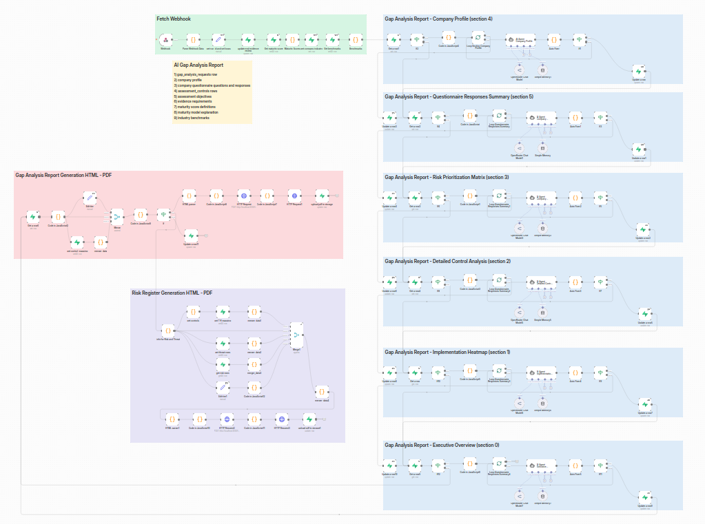
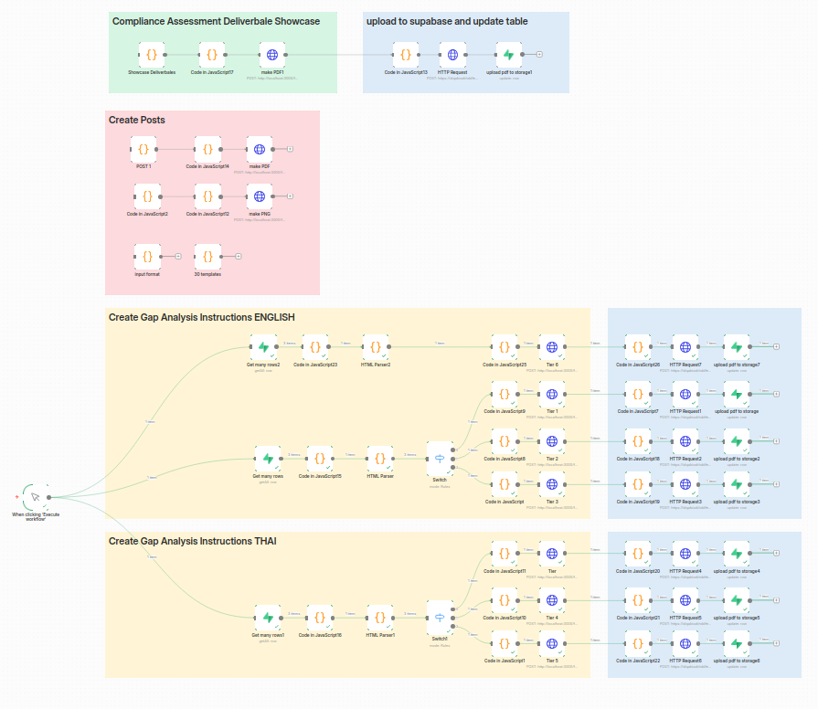
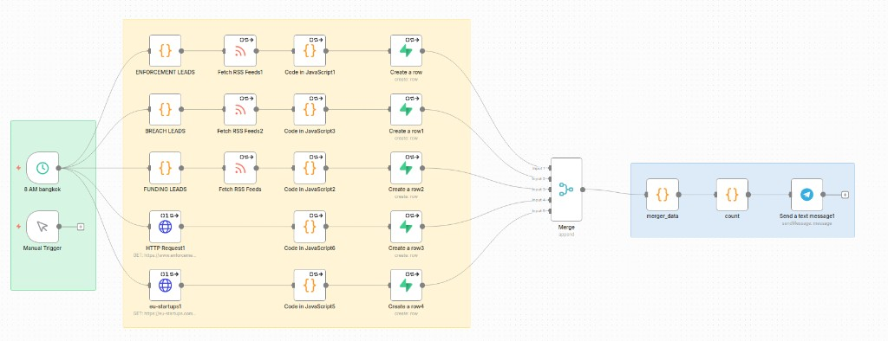

# Vulnox — case study

**Live product:** [vulnox.io](https://vulnox.io)

Automated security and compliance for organisations that need an assessment, a gap analysis, or a digital-footprint review without a six-week consulting engagement.

> **This repository is a case study and does not contain functional scanning code or credentials.**

---

## Problem

Manual security assessment and compliance gap analysis is slow, expensive, and inconsistent.

A typical mid-size company that needs GDPR, ISO 27001, or SOC 2 readiness still buys a consultant-week (or many). Questionnaires are copied into spreadsheets. Evidence is chased over email. Different analysts produce different reports from the same facts. Meanwhile the “what is actually exposed on the internet right now?” question is a separate vendor, a separate quote, and another wait.

The bottleneck is not a lack of frameworks or scanners. It is orchestration: payment → scoped work → evidence collection → review → a deliverable a non-security executive can act on.

## What I built

Vulnox is a self-serve platform with **three services**, fully automated from Stripe payment to deliverable, with **zero human intervention** in the happy path:

1. **Vulnerability assessment** — what is reachable and misconfigured *now*.
2. **Gap analysis** — readiness against **250+ compliance frameworks** (GDPR, ISO 27001, SOC 2, HIPAA, PCI DSS, NIS2, and regional standards), using a shared control language rather than a one-off spreadsheet per framework.
3. **Digital footprint analysis** — what historical public archives still expose about the organisation.

A customer picks a service, pays, answers a scoped questionnaire, uploads evidence where the framework requires it, and receives a structured deliverable (gap report, remediation roadmap, executive summary). An AI agent reviews uploaded evidence against controls; n8n orchestrates the long-running work.

## Architecture

See the technical write-up and the diagram:

- [architecture.md](./architecture.md) — data flow, how Supabase talks to n8n, how SCF → evidence mapping works conceptually
- [diagrams/architecture.mmd](./diagrams/architecture.mmd) — Mermaid flowchart (sanitized; no hostnames or URLs)

**In short:** Supabase is the product backend (auth, database, storage, edge functions, cron, email). **60+ n8n workflows** orchestrate open-source reconnaissance and assessment tools plus document generation. An AI agent reviews uploaded evidence against SCF-mapped controls. Stripe is the commercial trigger. The customer-facing app is a Next.js site.

Screenshots below are the n8n canvases themselves (node layout only — not workflow JSON, not live webhook URLs).

## n8n workflows (examples)

Three of the 60+ workflows, as they actually look in n8n. They illustrate orchestration, not a runnable export.

### 1. Gap Analysis Report

Generates a full AI-written compliance gap analysis report, section by section, once a client's assessment data is complete.

A webhook fetches the completed assessment record and pulls together everything needed to write the report: company profile, questionnaire answers, mapped controls, evidence submitted, maturity-score definitions, and industry benchmarks.

The report is then built as six independent parallel branches — Executive Overview, Implementation Heatmap, Detailed Control Analysis, Risk Prioritization Matrix, Company Profile, and Questionnaire Responses Summary — each one pulling its own slice of data, sending it to an LLM to draft that section, and writing the result back to the record.

Once all sections are ready, a separate branch assembles everything into HTML, converts it to PDF, and uploads the finished report to storage. A parallel branch does the same for a standalone Risk Register document.

**What this shows:** breaking a complex document-generation task into parallel, independently-testable LLM calls rather than one monolithic prompt, and turning structured data into a polished, ready-to-deliver PDF with no manual step.

### 2. Client Instructions & Deliverable Showcase

Produces the client-facing and marketing materials that go out around a compliance assessment.

- **Deliverable showcase:** takes the finished assessment output, formats it, generates a PDF, and uploads it to Supabase while updating the client's record.
- **Create Posts:** generates promotional assets in multiple formats (PDF, PNG, and templated visuals) for showcasing completed deliverables — used for marketing/social content.
- **Create Gap Analysis Instructions (English & Thai):** pulls the relevant guidance rows, parses them into HTML, and routes them by complexity tier (Tier 1 through 6) into six parallel branches, each producing a tier-specific instructional PDF that's uploaded to storage. The same logic runs twice — once per language — so clients receive instructions in their own language at the right complexity level for their assigned tier.

**What this shows:** multi-language content generation at scale, tiered/conditional branching in n8n, and the end-to-end client experience (not just the technical scan) — including localization.

### 3. Lead Generation

A scheduled daily job (8 AM Bangkok time, also manually triggerable) that collects sales leads from multiple public sources and delivers a digest.

Five parallel branches pull from different signal types: enforcement actions, data breach disclosures, funding announcements, and startup news — sourced via RSS feeds and direct HTTP requests to public sites.

Each branch parses its results in JavaScript and writes matching leads as new rows into a shared table. All five branches merge into one dataset, which is counted and formatted into a summary. The summary is sent as a Telegram message — a daily automated lead digest with no manual research involved.

**What this shows:** automated, multi-source market/lead intelligence gathering, scheduled workflow orchestration, and using automation for business development, not just technical delivery.

## Tech stack

| Layer | What I used |
| --- | --- |
| Product / UI | Next.js, TypeScript, Tailwind |
| Backend | Supabase — Auth, Postgres, Storage, Edge Functions, scheduled jobs, transactional email |
| Orchestration | n8n (60+ workflows) |
| Payments | Stripe |
| Assessment tooling | Automated web reconnaissance and vulnerability scanning tools (open-source scanners and archive analysis — orchestrated, not hand-run) |
| Compliance engine | Secure Controls Framework (SCF) mapping + AI evidence review |
| Hosting | Vercel (app) + Supabase (data plane) |

I describe the scanning layer **functionally** on purpose. This case study is not a catalogue of attack tooling.

## Sanitized example flow — “Acme Health” GDPR gap analysis

All names, files, and scores below are **placeholder fiction**. They are not real customers, real scans, or real findings.

1. **Request.** Acme Health (a fictional clinic group) chooses **GDPR gap analysis** on the product and pays via Stripe. Order reference: `AH-GDPR-0001`.
2. **Questionnaire.** After login, Acme Health answers a scoped questionnaire: they process patient records in the EU, use a third-party EHR, retain backups for seven years, and have no current DPO named. Answers are stored against control identifiers, not as a free-text blob.
3. **SCF mapping.** Those answers resolve to Secure Controls Framework (SCF) control numbers. SCF is the common language; GDPR articles are one *view* of that language. From SCF, the platform derives an **evidence request list** (ERL): “show us the record-of-processing”, “show us the processor contract”, “show us the retention schedule”, and so on.
4. **Evidence upload.** Acme Health uploads placeholder files such as `RoPA-template-v0.pdf` and `processor-addendum-draft.docx` into object storage. Nothing in this repo is a real upload.
5. **AI review.** An agent scores each evidence item against the mapped control: present / partial / missing, with a short rationale. Example placeholder result: *“Control SCF-PRI-01 (processing inventory): partial — document lists categories of data but not retention per category.”*
6. **Deliverable.** The platform generates a gap analysis report, a remediation roadmap, an executive summary, and a readiness score dashboard. Acme Health downloads PDFs from their account. No analyst touched the file.

A real engagement follows the same shape. The numbers, files, and company in this section are invented so this repo can stay public.

## What this demonstrates

- **Full-stack product build** — auth, billing, file uploads, reporting, and a customer dashboard, owned end to end.
- **Workflow orchestration at scale** — 60+ automated workflows instead of a hidden operations team.
- **Applied GRC / compliance domain knowledge** — SCF as a mapping layer, evidence as first-class data, deliverables a non-technical stakeholder can read.
- **AI used as a reviewer**, not as a magic black box: the agent is constrained to uploaded evidence and mapped controls.

---

**Reminder:** this repository is a case study and does not contain functional scanning code or credentials.
